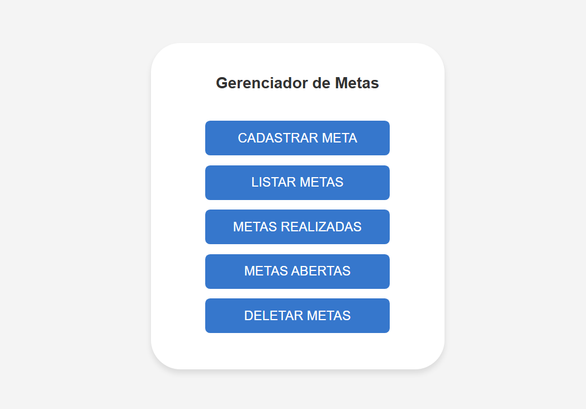

## Me chamo Ronny Senna 👋

- 🚀 Desenvolvedor Web Full Stack em evolução.
- 💻 Analista de Dados em evolução.
- 📙 Cursando ADS "Faculdade CDL"
- 💻 Focado em aprimorar meus conhecimentos em Pyton,C++,Banco de Dados,Java e JavaScript.

## **Sobre o projeto**

Uma aplicação para gerenciamento de metas gamificada, onde o usuário cadastra metas semanais e pode controlar em tempo real a pontuação. 

## Tecnologias Usadas 

JS, React, Node.js, Fastify, Zod, Drizzle, Vite, TailwindCSS, React Query e muito mais…

## Demonstração
 

<a href="https://app-meta.vercel.app/">🔗 Veja o projeto clicando aqui !
</a>

[ 🔗 Ou Veja um vídeo curtinho aqui](Site/Gravando.mp4)

## Screenshots

# Encontre-me

